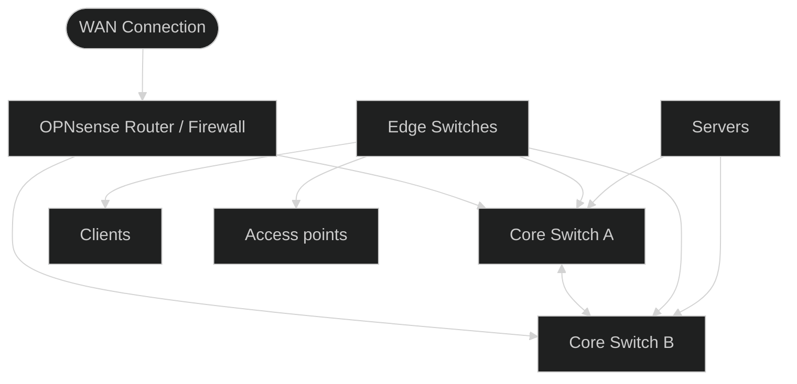

# lanmine_tech

```mermaid
%%{init: {'theme':'dark'}}%%

flowchart TD

    %% WAN + pfSense
    WAN([WAN Connection])
    OPNsense[OPNsense Router / Firewall]

    WAN --> OPNsense

    %% Core Switches
    COREA[Core Switch A]
    COREB[Core Switch B]

    OPNsense --> COREA
    OPNsense --> COREB

    COREA <--> COREB

    %% Edge Switches
    EDGE1[Edge Switches]
    EDGE1 --> COREA
    EDGE1 --> COREB

    %% Clients & APs
    CLIENTS[Clients]
    APS[Access points]
    EDGE1 --> CLIENTS
    EDGE1 --> APS

    %% Servers Block
    SRV[Servers]

    SRV --> COREA
    SRV --> COREB
```
