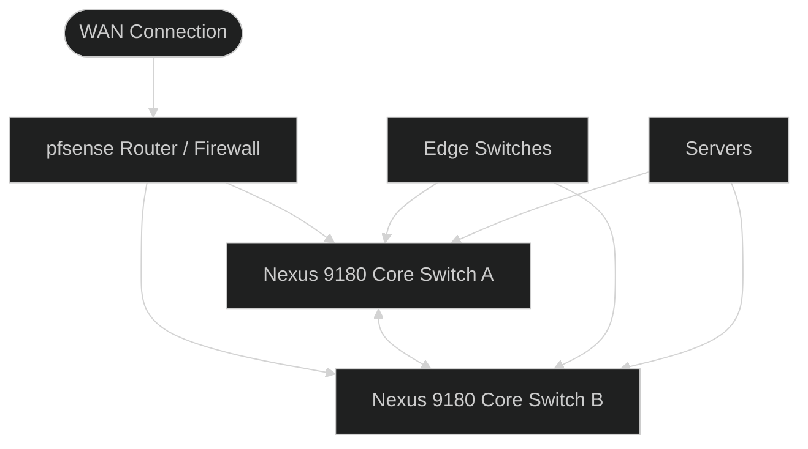

# lanmine_tech

```mermaid
%%{init: {'theme':'dark'}}%%

flowchart TD

    %% WAN + pfSense
    WAN([WAN Connection])
    PF[pfsense Router / Firewall]

    WAN --> PF

    %% Core Switches
    COREA[Nexus 9180 Core Switch A]
    COREB[Nexus 9180 Core Switch B]

    PF --> COREA
    PF --> COREB

    COREA <--> COREB

    %% Edge Switch on left side of Core A
    EDGE1[Edge Switches]
    EDGE1 --> COREA
    EDGE1 --> COREB

    %% Servers Block
    SRV[Servers]

    SRV --> COREA
    SRV --> COREB
```
