# Lanmine.no Infrastructure

[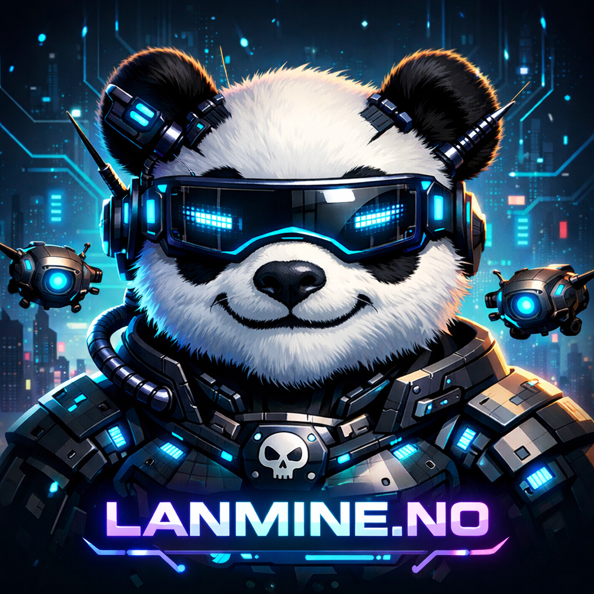](https://lanmine.github.io/lanmine_tech/)

## LANmine 41 - Gjennomført!

Da er ESPORTS LAN GAMING https://lanmine.no/ 41 gjennomført! Stor takk til Blix Solutions AS sørget for at lanet hadde egen 10G uplink for første gang⚡ Noen høydepunkter:

• Første vellykka speedtest på 10G
• Da vi fant ut at core-switchen var koblet på samme kurs som strykejernet
• Annonsering hver dag når klokka var 13:37
• Da AI-boten vår gjorde noe veldig dumt... for andre gang🤖🤖🤖
• Nettverksrigg med supertalentet Nathalie Solheim
• At Tech chief Carl Henning Haugen og jeg faktisk fikk gamet litt også 🖥️
• Feilsøking av deltagerpc med Keith Eriksson fra Tech, hvor displayportskjermen kun funket om HDMI også var koblet til på en annen skjerm

Og stor takk til Back IT Up AS som lånte oss blant annet en 100 meter fiberkabel som kom veldig godt med. PS! Om noen ønsker å sponse LANmine med fiberkabler så har vi stort behov for 80-100 og 30 meter SM kabler. Ses til LANmine 42 i høstferien, 1. - .4 oktober 🌐

---

### Event Gallery

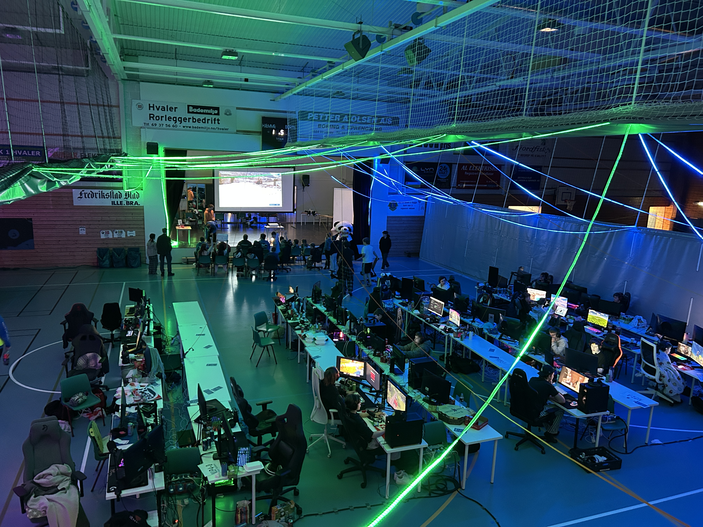
*LANmine atmosphere*

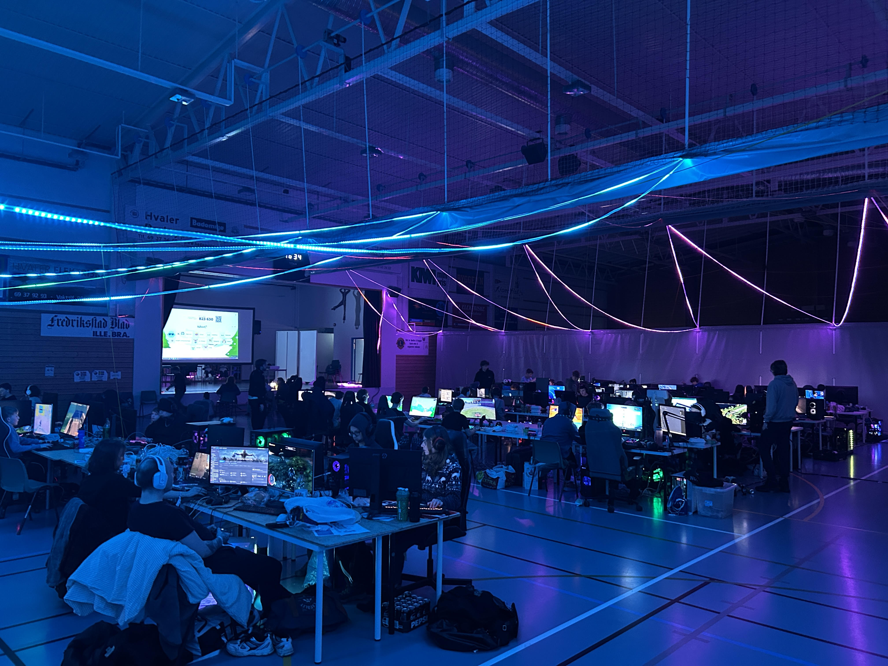
*More LANmine vibes*

*The amazing tech crew*

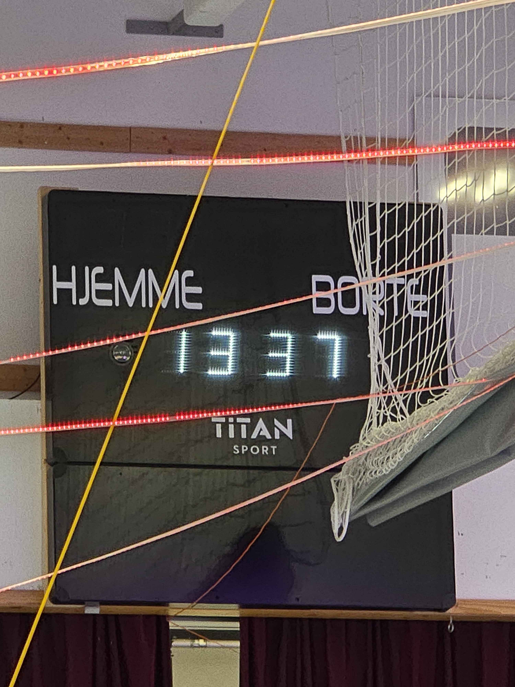
*Daily 13:37 announcement*

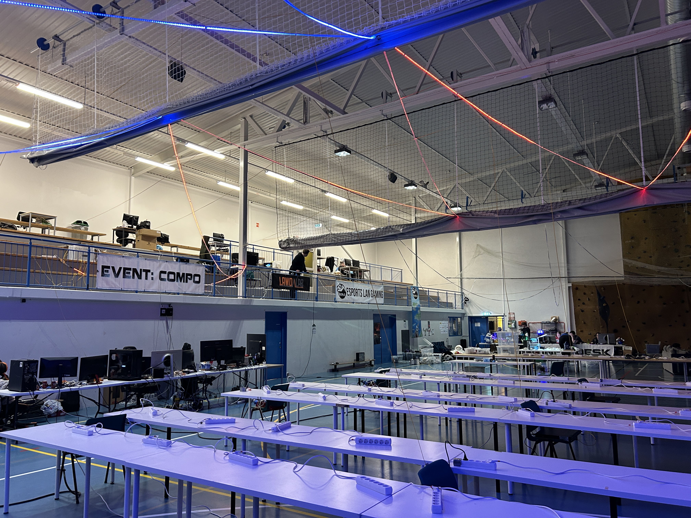
*Setting up the venue*

### Infrastructure & Network

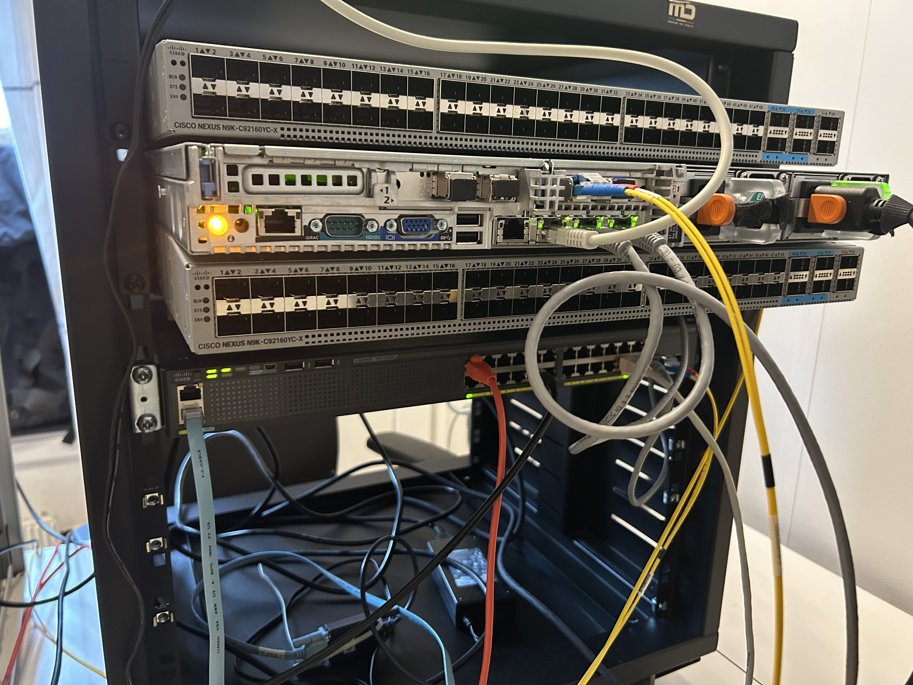
*Initial rack configuration*

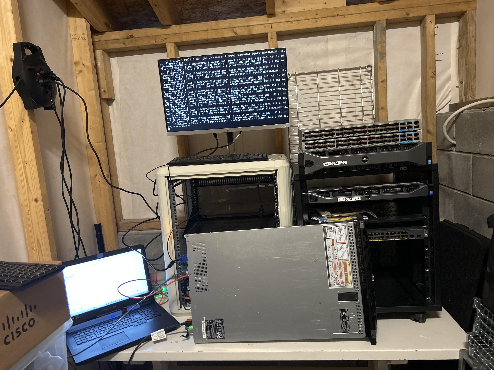
*Lab preparation*

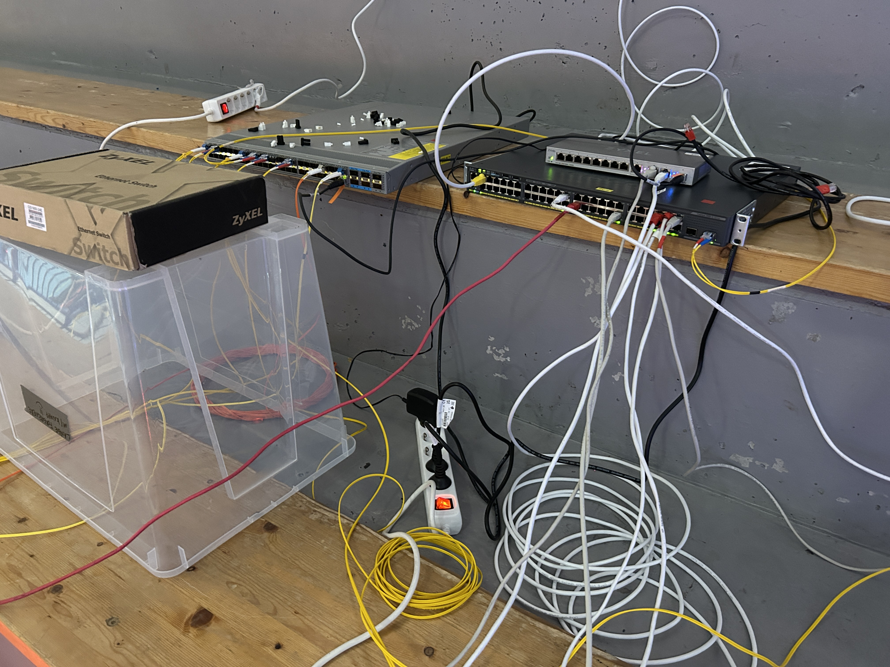
*Core network switch*

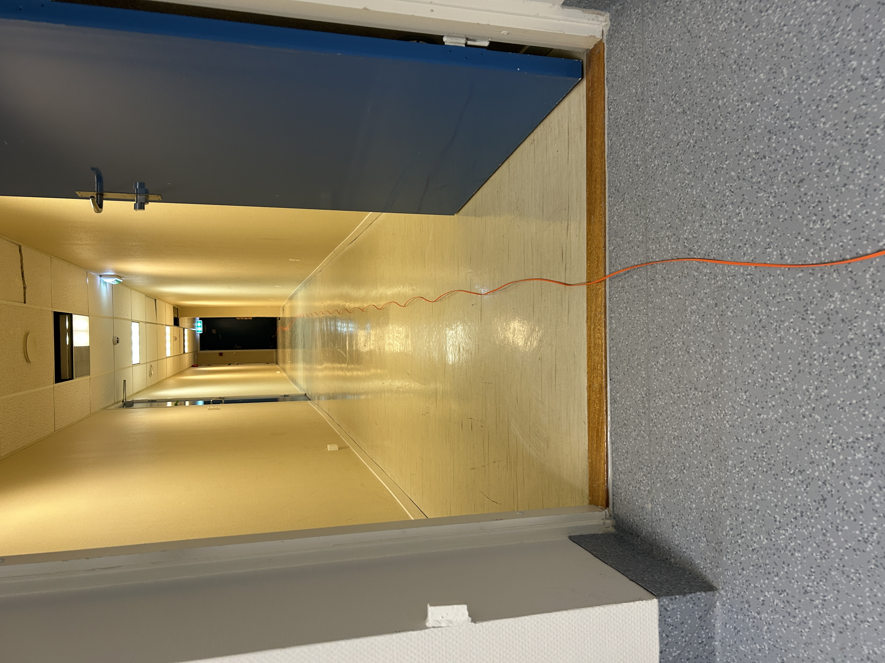
*Fiber infrastructure*

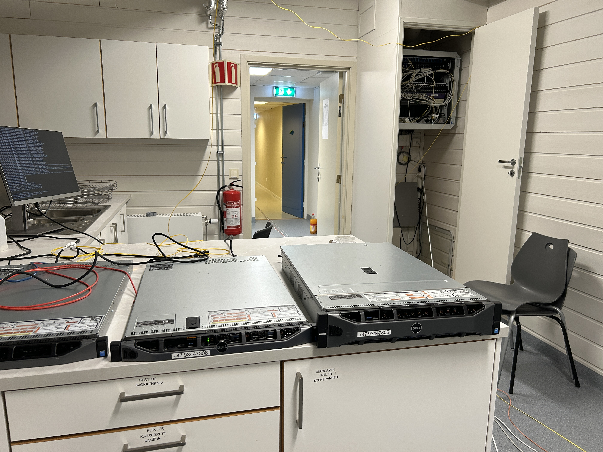
*Infrastructure overview*

### Performance & Monitoring

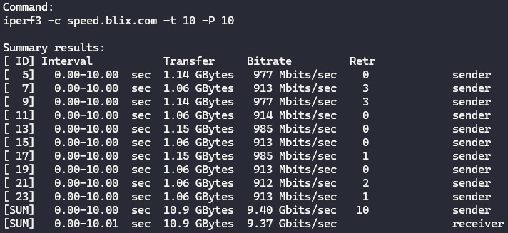
*First successful 10G speedtest!*

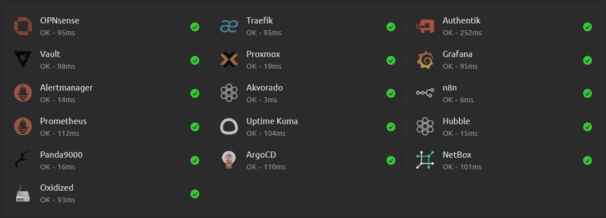
*System monitoring*

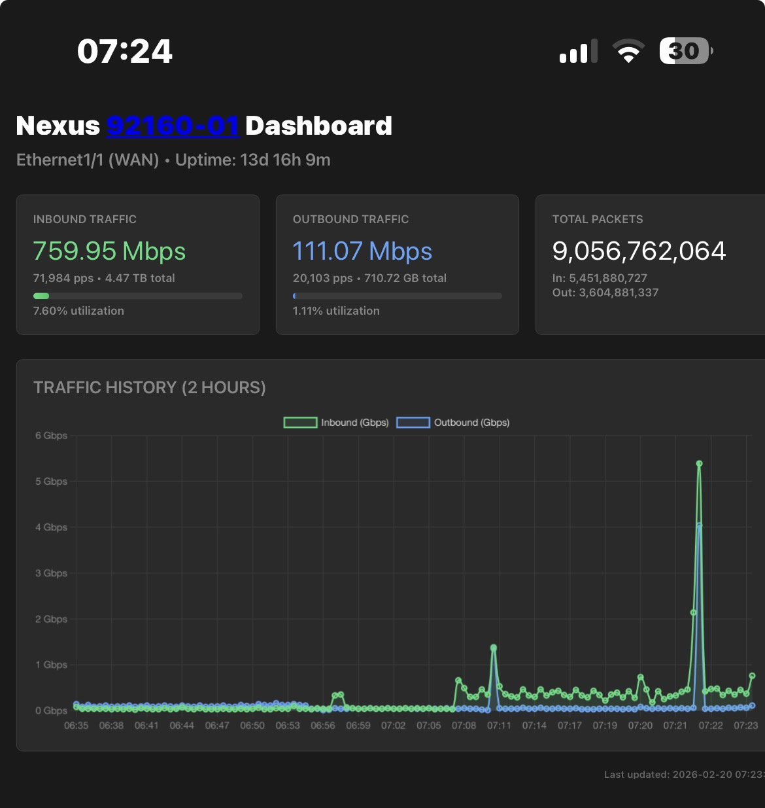
*Network monitoring setup*

### Automation

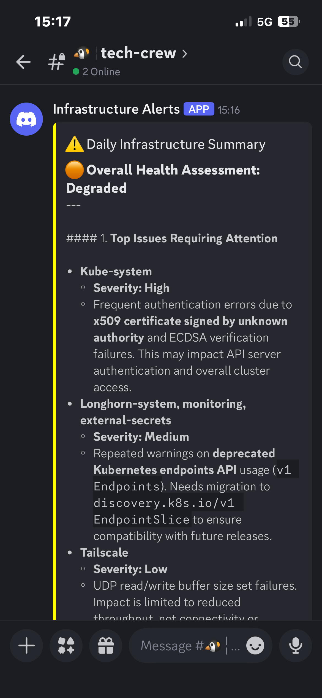
*Discord bot automation*

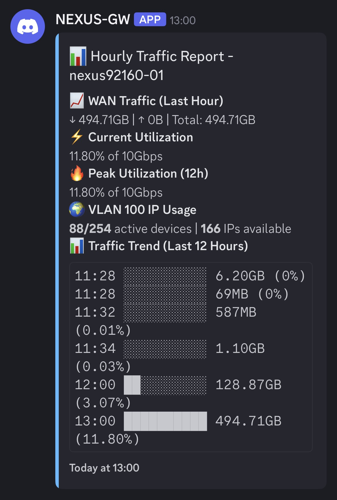
*Network device notifications*
