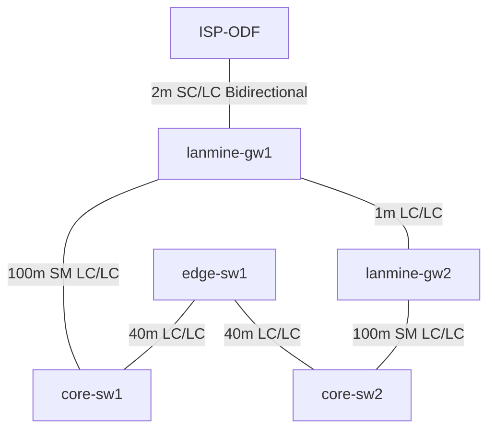

```
⠀⠀⠀⢀⣠⣤⣤⣤⣀⡀⠀⠀⠀⠀⠀⠀⠀⠀⠀⠀⢀⣀⣤⣤⣤⣄⡀⠀⠀⠀
⠀⠀⣼⠋⠁⠀⠀⠀⣉⣿⣷⣶⣿⣿⣿⣿⣿⣿⣶⣾⣿⣉⠀⠀⠀⠈⠙⣧⠀⠀
⠀⠀⣿⠀⠀⢀⣴⣿⣿⣿⣿⣿⣿⣿⣿⣿⣿⣿⣿⣿⣿⣿⣿⣦⡀⠀⠀⣿⠀⠀
⠀⠀⠹⣆⣴⣿⣿⣿⣿⣿⣿⣿⣿⣿⣿⣿⣿⣿⣿⣿⣿⣿⣿⣿⣿⣦⣰⠏⠀⠀
⠀⠀⠀⣽⣿⣿⣿⡿⠟⠋⠉⠙⢿⣿⣿⣿⣿⡿⠋⠉⠙⠻⢿⣿⣿⣿⣯⠀⠀⠀
⠀⠀⢰⣿⣿⡿⠋⠀⠀⠀⠀⠀⠈⣿⣿⣿⣿⠁⠀⠀⠀⠀⠀⠙⢿⣿⣿⡆⠀⠀
⠀⠀⣿⣿⣿⡇⠀⠀⠀⠀⢀⣄⠀⣿⣿⣿⣿⠀⣠⡀⠀⠀⠀⠀⢸⣿⣿⣿⠀⠀
⠀⠀⣿⣿⣿⣿⡀⠀⠀⠀⠈⠋⣼⣿⣿⣿⣿⣧⠙⠁⠀⠀⠀⢀⣿⣿⣿⣿⠀⠀
⠀⠀⢿⣿⣿⣿⣷⡀⠀⢀⣠⣾⣿⣿⣿⣿⣿⣿⣷⣄⡀⠀⢀⣾⣿⣿⣿⣿⠀⠀
⠀⠀⠘⣿⣿⣿⣿⣿⣿⣿⣿⣿⣿⣿⣿⣿⣿⣿⣿⣿⣿⣿⣿⣿⣿⣿⣿⠇⠀⠀
⠀⠀⠀⠘⠿⣿⣿⣿⣿⣿⣿⣿⣯⡀⠀⠀⢀⣽⣿⣿⣿⣿⣿⣿⣿⡿⠋⠀⠀⠀
⠀⠀⠀⠀⠀⠀⠉⠙⣿⣿⣿⣿⣿⣿⣦⣴⣿⣿⣿⣿⣿⣿⠋⠉⠁⠀⠀⠀⠀⠀
⠀⠀⠀⠀⠀⠀⠀⠀⠈⢿⣿⣇⡉⠻⠿⠿⠟⢉⣸⣿⡿⠁⠀⠀⠀⠀⠀⠀⠀⠀
⠀⠀⠀⠀⠀⠀⠀⠀⠀⠈⠛⠿⢿⣿⣶⣶⣿⡿⠿⠛⠁⠀⠀⠀⠀⠀⠀⠀⠀⠀
⠀⠀⠀⠀⠀⠀⠀⠀⠀⠀⠀⠀⠀⠀⠀⠀⠀⠀⠀⠀⠀⠀⠀⠀⠀⠀⠀⠀⠀⠀⠀⠀⠀⠀
  ██╗      █████╗ ███╗   ██╗███╗   ███╗██╗███╗   ██╗███████╗
  ██║     ██╔══██╗████╗  ██║████╗ ████║██║████╗  ██║██╔════╝
  ██║     ███████║██╔██╗ ██║██╔████╔██║██║██╔██╗ ██║█████╗
  ██║     ██╔══██║██║╚██╗██║██║╚██╔╝██║██║██║╚██╗██║██╔══╝
  ███████╗██║  ██║██║ ╚████║██║ ╚═╝ ██║██║██║ ╚████║███████╗
  ╚══════╝╚═╝  ╚═╝╚═╝  ╚═══╝╚═╝     ╚═╝╚═╝╚═╝  ╚═══╝╚══════╝

  ──────────────────────────────────────────────────────────
   Event ......... LANmine 42 ~ The Meaning of LAN
   Location ....... Hvalerhallen, Vesterøy
   Date ........... 01 Oct – 04 Oct 2026
   VIP doors ...... 11:00  |  General doors: 14:00
   Mood ......... 🐼  Panda
   Org ............ Esports LAN Gaming
  ──────────────────────────────────────────────────────────
   os         LAN Party OS v42.0 (Hvalerkernel)
   uptime     3 days, 23 hrs, 59 mins
   shell      /bin/caffeine
   terminal   RGB mechanical @ 1000Hz
   network    10 Gbps  |  packet loss is banned 
   latency    <1ms less than speed of light
   power      5x energy drinks
   memory     sleep deprived but functional
  ──────────────────────────────────────────────────────────
   "Eat. Game. Nap. Repeat. 🐼"
  ──────────────────────────────────────────────────────────
```

## Hardware 
```
2x Cisco Catalyst 3650
2x Cisco Nexus 91260
12x Cisco Catalyst 2960X
...
```

## Layer 1 (physical)


