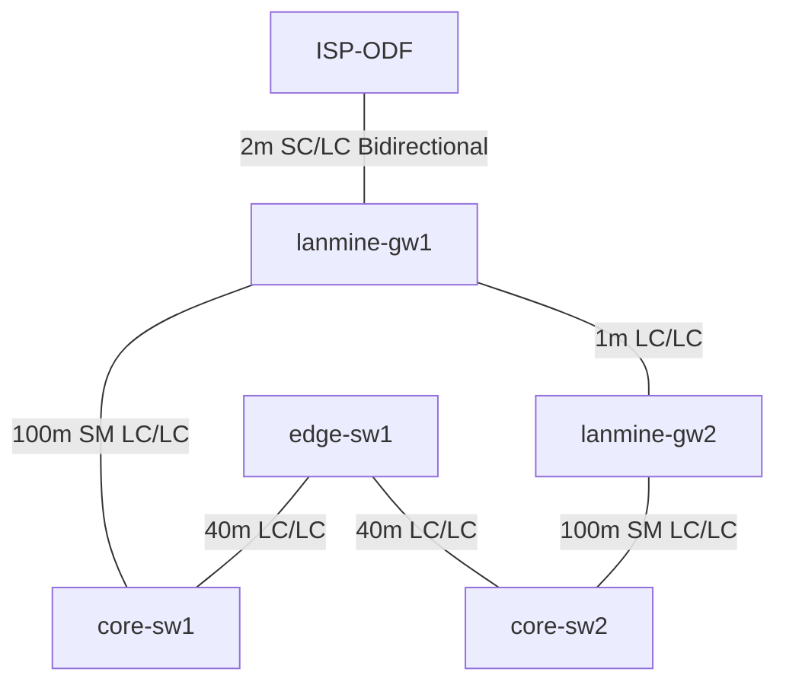

# Lanmine 42

Infrastructure and automation for Lanmine 42.

## Overview layer 1

```mermaid
graph TD
    ISP-ODF ---|2m SC/LC Bidirectional| lanmine-gw1
    lanmine-gw1 ---|100m SM LC/LC| core-sw1
    lanmine-gw2 ---|100m SM LC/LC| core-sw2
    lanmine-gw1 ---|1m LC/LC| lanmine-gw2
    edge-sw1 ---|40m LC/LC| core-sw1
    edge-sw1 ---|40m LC/LC| core-sw2
```
